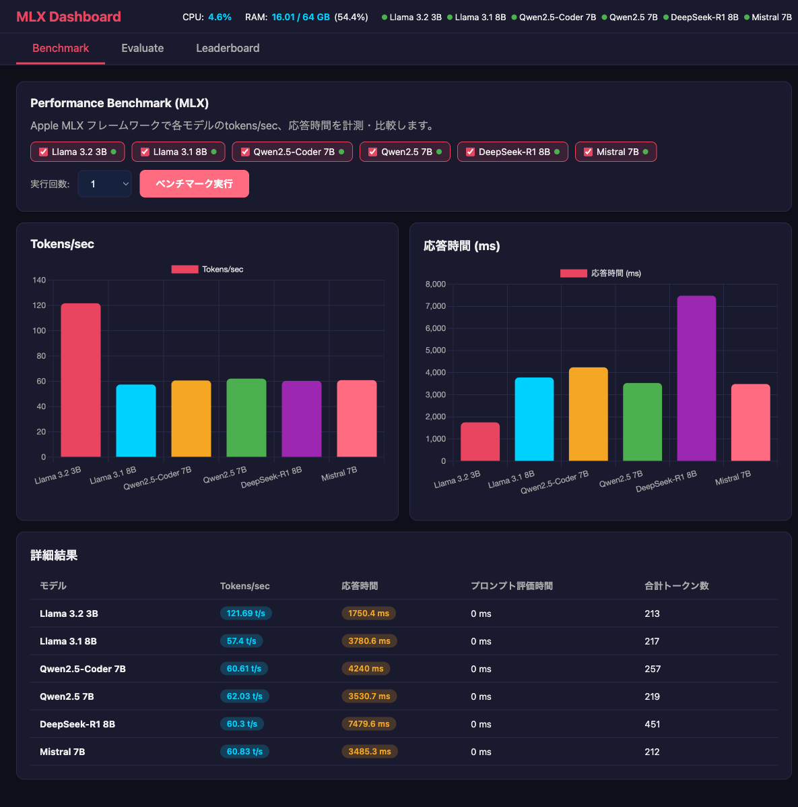
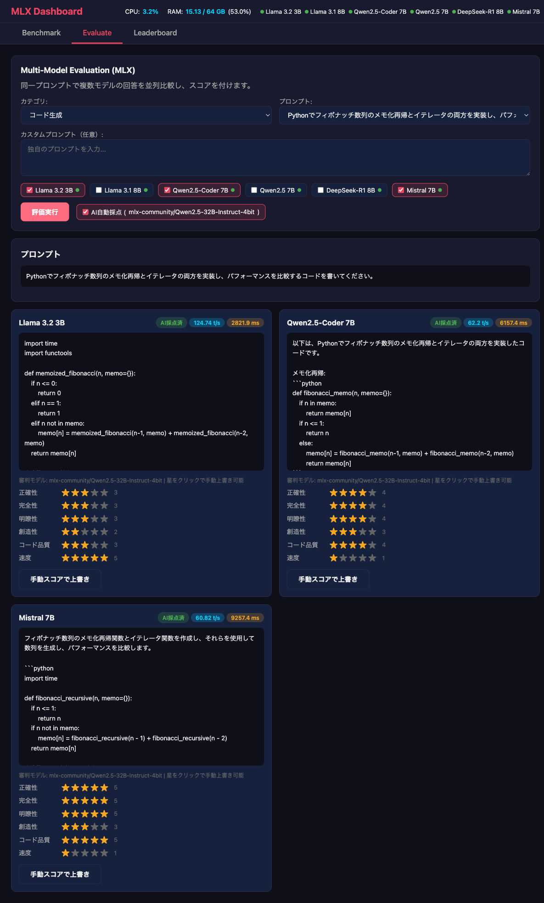
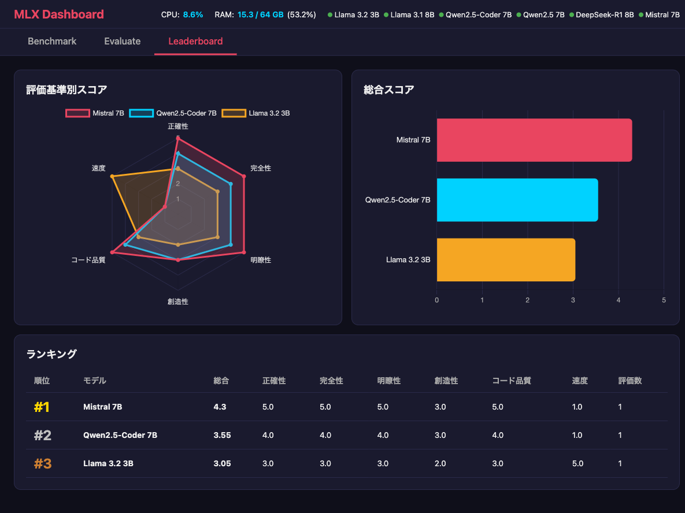

# MLX Dashboard

Apple MLX フレームワークによるローカルLLMモデルのパフォーマンス比較・回答精度評価ダッシュボード。

MLX-LM + FastAPI で構築。Ollama不要、Python直接実行。

## スクリーンショット

### Benchmark タブ
全6モデルのtokens/sec・応答時間を比較。Llama 3.2 3Bが121 t/sで最速。



### Evaluate タブ
同一プロンプトで3モデルの回答を並列比較。Qwen2.5-32Bが自動採点。



### Leaderboard タブ
レーダーチャート・横棒グラフ・ランキングテーブルで総合評価。



## 構成

| サービス | URL | 説明 |
|---------|-----|------|
| Dashboard | http://localhost:8502 | モデル比較ダッシュボード |

## 導入モデル

| モデル | HuggingFace ID | 用途 |
|--------|---------------|------|
| Llama 3.2 3B | mlx-community/Llama-3.2-3B-Instruct-4bit | 軽量チャット |
| Llama 3.1 8B | mlx-community/Llama-3.1-8B-Instruct-4bit | 汎用高品質 |
| Qwen2.5-Coder 7B | mlx-community/Qwen2.5-Coder-7B-Instruct-4bit | コーディング |
| Qwen2.5 7B | mlx-community/Qwen2.5-7B-Instruct-4bit | 多言語対応 |
| DeepSeek-R1 8B | mlx-community/DeepSeek-R1-Distill-Llama-8B-4bit | 推論特化 |
| Mistral 7B | mlx-community/Mistral-7B-Instruct-v0.3-4bit | 汎用欧州モデル |

## 前提条件

- macOS (Apple Silicon M1以降)
- [uv](https://docs.astral.sh/uv/)
- Python 3.12+

## クイックスタート

```bash
cd mlx-dashboard
make setup             # venv作成 + 依存インストール (mlx-lm含む)
make download-models   # 6モデル + 審判モデル取得（初回のみ）
make start             # ダッシュボード起動
make status            # 状態確認
```

## Makefile コマンド一覧

| コマンド | 説明 |
|---------|------|
| `make setup` | 初期セットアップ（venv + 依存インストール） |
| `make start` | ダッシュボード起動 |
| `make stop` | ダッシュボード停止 |
| `make restart` | 再起動 |
| `make status` | 状態 + モデルDL状況表示 |
| `make download-models` | 全モデル取得 |
| `make logs` | ログ表示 |
| `make clean` | 停止 + データ削除 |

## ダッシュボード機能

### Benchmark タブ

MLXフレームワークで各モデルのtokens/sec、応答時間を計測・比較:

- **Tokens/sec** - 生成速度（棒グラフ）
- **応答時間** - 総応答時間（棒グラフ）
- **詳細テーブル** - 合計トークン数

ウォームアッププロンプトでモデルロード時間を分離し、計測後にモデルをアンロードして公平な環境で比較。

### Evaluate タブ

同一プロンプトで複数モデルの回答を並列比較:

- **5カテゴリ** - 一般知識 / コード生成 / 論理推論 / 創作 / 指示遵守
- **15プロンプト** - 各カテゴリ3問
- **カスタムプロンプト** - 任意のプロンプトも入力可
- **AI自動採点** - Qwen2.5-32B (MLX) による自動スコアリング（ON/OFF切替可）
- **手動評価** - 星をクリックして手動スコア上書き可能

### Leaderboard タブ

- **レーダーチャート** - 評価基準別のモデル比較
- **横棒グラフ** - 総合スコア
- **ランキングテーブル** - 順位、基準別スコア、評価数

### 評価基準（重み付き）

| 基準 | 重み | 評価方法 | 説明 |
|------|------|---------|------|
| 正確性 | 25% | AI / 手動 | 事実の正確さ、コードの正しさ |
| 完全性 | 20% | AI / 手動 | 質問への回答の網羅性 |
| 明瞭性 | 20% | AI / 手動 | 説明のわかりやすさ |
| 創造性 | 15% | AI / 手動 | 独創性、表現力 |
| コード品質 | 10% | AI / 手動 | 可読性、効率性 |
| 速度 | 10% | 自動計算 | tokens/secを1-5に正規化 |

## Ollama Dashboard との違い

| 項目 | Ollama Dashboard | MLX Dashboard |
|------|-----------------|---------------|
| 推論エンジン | Ollama (REST API) | MLX-LM (Pythonインプロセス) |
| モデル形式 | GGUF | MLX (4bit量子化) |
| モデル取得元 | ollama pull | HuggingFace Hub |
| チャットUI | Open WebUI (Docker) | なし (ダッシュボード専用) |
| GPU活用 | Metal (Ollama経由) | Metal (MLX直接) |
| 審判モデル | qwen3:32b (Ollama) | Qwen2.5-32B-Instruct-4bit (MLX) |
| ポート | 8501 | 8502 |

## 技術スタック

- **Backend**: FastAPI + MLX-LM + psutil + Pydantic
- **Frontend**: HTML/CSS/JS + Chart.js (ビルド不要)
- **LLM**: Apple MLX フレームワーク (mlx-lm)
- **自動採点**: Qwen2.5-32B-Instruct-4bit (審判モデル、変更可能)
- **データ永続化**: JSON ファイル (`app/data/results.json`)

## プロジェクト構成

```
mlx-dashboard/
├── pyproject.toml
├── Makefile
├── README.md
├── app/
│   ├── main.py                # FastAPI エントリポイント
│   ├── config.py              # モデル定義、評価プロンプト、審判モデル設定
│   ├── routers/
│   │   ├── models.py          # モデル一覧・状態
│   │   ├── benchmark.py       # ベンチマーク実行・結果
│   │   ├── evaluate.py        # マルチモデル評価 + 自動採点
│   │   └── scoring.py         # スコア登録・リーダーボード
│   ├── services/
│   │   ├── mlx_client.py      # MLX-LM 推論クライアント
│   │   ├── auto_scorer.py     # AI自動採点 + 速度スコア計算
│   │   ├── benchmark_service.py
│   │   ├── evaluation_service.py
│   │   ├── scoring_service.py
│   │   └── system_monitor.py
│   ├── models/
│   │   └── schemas.py         # Pydantic スキーマ
│   └── data/
│       └── results.json       # 評価結果（自動生成）
├── static/
│   ├── index.html             # SPA ダッシュボード
│   ├── css/style.css
│   └── js/
│       ├── app.js
│       ├── api.js
│       ├── charts.js
│       ├── benchmark.js
│       ├── evaluate.js
│       └── scoring.js
└── tests/
```
